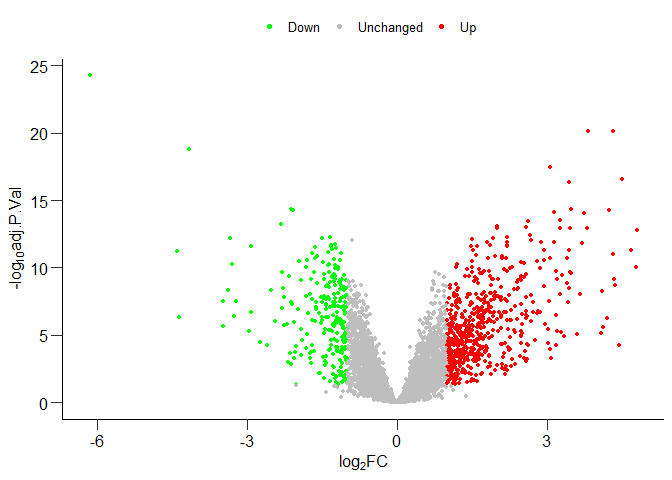
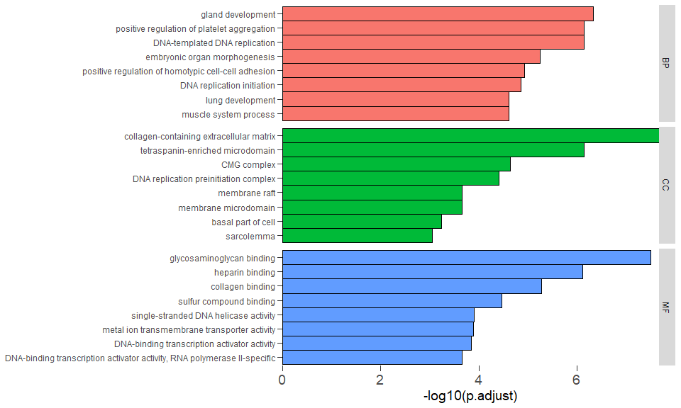

<!-- README.md is generated from README.Rmd. Please edit that file -->

[](https://github.com/snowGlint/easybio/actions/workflows/check-standard.yaml)

``` r
library(easybio)
```

## GEO下载整理

给定GSE编号, 检查是否存在表达矩阵信息, 如有,
从GPL注释信息中对表达矩阵进行注释, 可选的注释方法包括max和mean。

``` r
y <- download_geo("GSE119186", dir = ".")
# return a list with annotated gene expression data.table object and metadata
```

## `analyze`函数

所有分析都通过`analyze`函数调用, 通过指定Object,
以及task自动完成任务分配。
所有`analyze`返回的结果都可以直接调用`plot`函数查看结果。`plot`返回的结果为`ggplot`object,
可用于后续自定义修改图片细节。

``` r
data(expr) # differential analysis
y <- analyze(object = expr, task = "limma", pattern = "cc", data_type = "array")
plot(y) # S3 method for all analysis
```



``` r
# GO
library(org.Hs.eg.db)
z <- analyze(object = gene_vector, task = "go", ont = "ALL") #
plot(z)
```



调整图片颜色:

``` r
library(viridis)
p <- plot(z)
p + scale_fill_viridis(discrete = TRUE)
```

## Reductor对象

用于方便查看降维算法不同参数组合的可视化效果。

``` r
library(palmerpenguins)

x <-
  penguins |>
  tidyr::drop_na()

y <- x$species
x <- x |>
  dplyr::select(where(is.numeric)) |>
  dplyr::select(-year)
x <- scale(x)
# show the results of different arguments
happy <- Reductor$new("tsne")
set.seed(20230530)
tune_fit <- happy$tune(x,
  perplexity = c(30, 40, 50, 60),
  n_iter = c(1000, 2000, 2500)
)
happy$plot(tune_fit, y)
```
