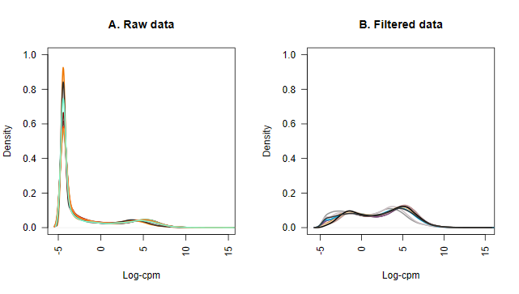
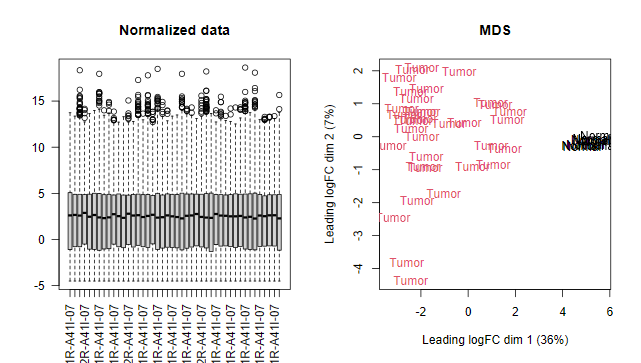

```{r, include = FALSE}
knitr::opts_chunk$set(
  collapse = TRUE,
  comment = "#>",
  fig.align = 'center'
)
```

This vignette provides a step-by-step guide on how to perform bulk RNA-Seq analysis using the Limma-voom workflow. It is designed to be a comprehensive resource for researchers looking to analyze gene expression data from projects such as TCGA. 
You can view an example script for this workflow by running the following command

```r
file.show(system.file(package = 'easybio', 'example-bulk-rna-seq.R'))
```


## Limma-voom workflow

####  Prepare data

For downloading and processing datasets from the Gene Expression Omnibus (GEO), utilize the `prepare_geo()` function. This function will generate a list containing count data, sample information, and gene data.

```{r}
library(easybio)
# x <- prepare_geo('gseid')
```

When preparing The Cancer Genome Atlas (TCGA) RNA-Seq data, employ the `prepare_tcga()` function from the TCGAbiolinks package. This function returns a list with count data for all samples and unstranded FPKM data for tumor samples, along with sample and feature information.

#### Example Workflow: TCGA CHOL Project

For a detailed overview of the Limma workflow, refer to the article: [RNA-seq analysis is as easy as 1-2-3 with limma, Glimma and edgeR](https://doi.org/10.12688/f1000research.9005.3). Three functions are designed for this workflow:

```r
library(TCGAbiolinks)
library(easybio)
library(data.table)

query <- GDCquery(
  project = "TCGA-CHOL",
  data.category = "Transcriptome Profiling",
  data.type = "Gene Expression Quantification"
)
GDCdownload(query = query)
data <- GDCprepare(query = query)

lt <- prepare_tcga(data)
lt$all$sampleInfo[["group"]] <- fifelse(lt$all$sampleInfo$sample_type %ilike% "Tumor", "Tumor", "Normal")

# limma-voom workflow
x <- dgeList(lt$all$exprCount, lt$all$sampleInfo, lt$all$featuresInfo)
x <- dprocess_dgeList(x, "group", 10)
efit <- limmaFit(x, "group")
get_attr(efit, "contrast")

CHOL_DEGs <- limma::topTable(fit = efit, coef = 1, number = Inf)
```

```{r, echo=FALSE}

```

```{r, echo=FALSE}

```

Set the criteria for differential gene expression:

```r
CHOL_DEGs[, let(
  tumor_vs_normal = fcase(
    adj.P.Val < 0.05 & logFC > 2, "Up",
    adj.P.Val < 0.05 & logFC < -2, "Down",
    default = "Not-Significant"
  )
)]
setDT(CHOL_DEGs, keep.rownames = "rid")
head(CHOL_DEGs)
```

Visualize the differentially expressed genes (DEGs) with a volcano plot:

```{r, fig.dim=c(5, 3)}
data(CHOL_DEGs)
plotVolcano(
  data = CHOL_DEGs,
  x = logFC,
  y = -log10(adj.P.Val),
  color = tumor_vs_normal
)
```

For pathway enrichment analysis, such as GO and KEGG, download the r4msigdb package to access the MSigDB gene sets. For more details on this package, please see [r4msigdb](https://github.com/person-c/r4msigdb).

```{r, fig.dim=c(7, 3)}
library(data.table)
# Over Presentation Analysis(ORA)
pathwayGO <- r4msigdb::query("Hs", pathway = "^GO(BP|CC|MF)_")
pathwayGO <- setNames(pathwayGO$symbol, pathwayGO$standard_name)

oraRes <- fgsea::fora(
  pathways = pathwayGO,
  genes = CHOL_DEGs[.("Up"), gene_name, on = .(tumor_vs_normal)],
  universe = unique(CHOL_DEGs$gene_name)
)
oraRes[, let(
  category = fcase(
    pathway %like% "GOBP", "BP",
    pathway %like% "GOMF", "MF",
    pathway %like% "GOCC", "CC"
  )
)]

oraRes <- oraRes[, .SD[order(padj)], by = .(category)]
oraRes[, let(pathwayGO = factor(pathway, levels = rev(pathway)))]
plotORA(
  data = oraRes[, head(.SD, 5), by = category],
  x = -log10(padj),
  y = pathwayGO,
  size = log10(overlap),
  fill = category
)
```

To perform Gene Set Enrichment Analysis (GSEA), use the `fgsea::fgsea()` function. The core function is adapted from the fgsea package with minor visual enhancements.

```{r}
library(fgsea)
data(examplePathways)
data(exampleRanks)
```

Run the GSEA analysis:

```{r,fig.width=4, fig.height=2.7}
fgseaRes <- fgsea(pathways = examplePathways, 
                  stats    = exampleRanks,
                  minSize  = 15,
                  maxSize  = 500)
plotGSEA(
  fgseaRes, 
  pathways = examplePathways, 
  pwayname = "5991130_Programmed_Cell_Death", 
  stats = exampleRanks, 
  save = FALSE
)
```